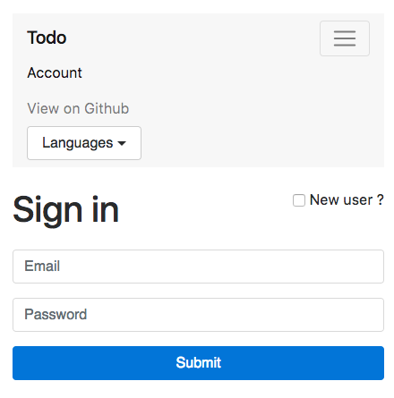
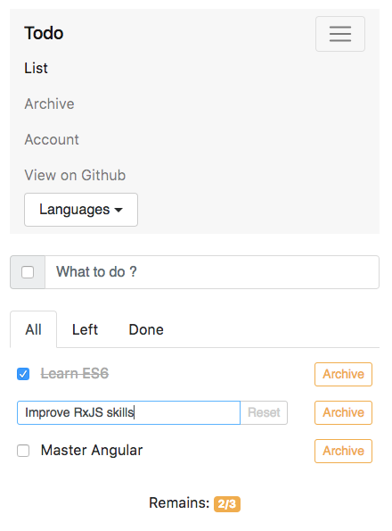

# angular-todo
Manage your todo list with Angular 4, Bootstrap 4 and Firebase 4.

#### Sign in page:


#### Main page:


## Configuration

To run the project, open the `environment.ts` file and initialize Firebase with your project's customized code snippet.

```javascript
export const environment = {
  firebase: {
    apiKey: '<API_KEY>',
    authDomain: '<PROJECT_ID>.firebaseapp.com',
    databaseURL: 'https://<DATABASE_NAME>.firebaseio.com'
  }
};
```
